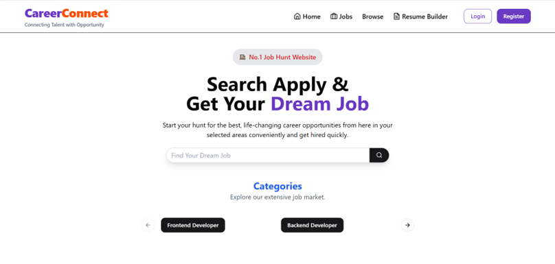
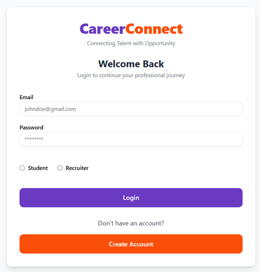
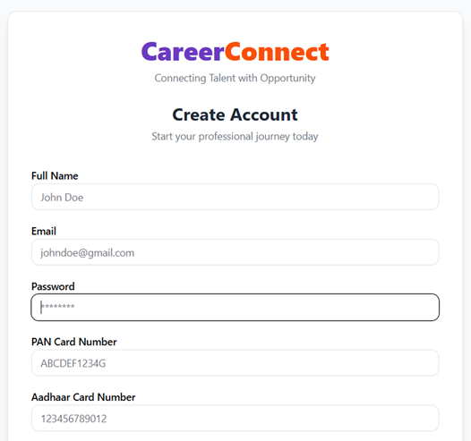
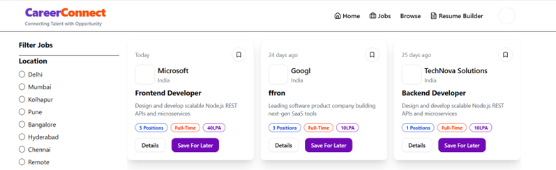
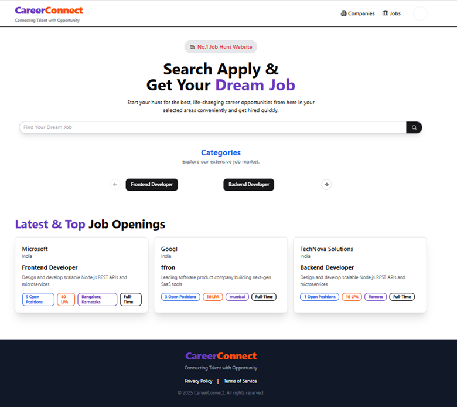
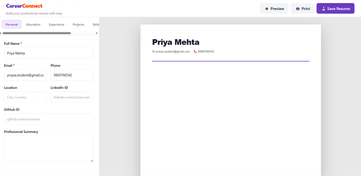

# 🚀 CareerConnect – Full Stack Job Portal & Resume Builder

<p align="center">
  <strong>A MERN-based recruitment platform connecting job seekers and recruiters through a centralized hiring system.</strong>
</p>

<p align="center">


</p>

---

## 📖 About The Project

**CareerConnect** is a full-stack **MERN (MongoDB, Express.js, React.js, Node.js)** web application designed to simplify the recruitment process by connecting job seekers and recruiters on a single platform.

The platform enables students and job seekers to create professional profiles, build and manage resumes, search for relevant job opportunities, apply for jobs, and track their application status.

Recruiters can create and manage companies, post job openings, view applicants, and manage applications through dedicated recruiter functionality.

The application uses **JWT authentication, role-based authorization, RESTful APIs, Redux Toolkit for state management, MongoDB for data persistence, and Cloudinary for file and image storage**.

---

# ✨ Key Features

## 👨‍🎓 Student / Job Seeker Module

- 🔐 User Registration & Secure Login
- 👤 Create and Update Professional Profile
- 📄 Resume Creation, Upload & Management
- 🔎 Browse and Search Job Opportunities
- 💼 View Job Details
- 📩 Apply for Jobs
- 📊 Track Applied Jobs
- 📌 View Application Status
- 🔒 Protected Student Features

---

## 🏢 Recruiter Module

- 🔐 Recruiter Registration & Authentication
- 🏢 Create and Manage Companies
- 💼 Post Job Openings
- ✏️ Manage Job Listings
- 👥 View Applicants
- 📋 Manage Applications
- ✅ Accept or Reject Applicants
- 📊 Recruiter Job Management

---

## 🔐 Security & Authentication

- JWT-based Authentication
- HTTP-only Cookie Authentication
- Role-Based Authorization
- Protected Routes
- Secure Password Hashing using bcryptjs
- Environment Variables for Sensitive Credentials
- Middleware-Based Authentication & Authorization

---

# 🛠️ Tech Stack

## Frontend

- **React.js**
- **Redux Toolkit**
- **Tailwind CSS**
- **Axios**
- **React Router DOM**

## Backend

- **Node.js**
- **Express.js**
- **JWT Authentication**
- **Multer**
- **Cloudinary**
- **bcryptjs**

## Database

- **MongoDB**
- **Mongoose**

---

# 🏗️ System Architecture

```text
                    CareerConnect
                         │
            ┌────────────┴────────────┐
            │                         │
        Job Seeker                Recruiter
            │                         │
     ┌──────┴──────┐          ┌──────┴──────┐
     │             │          │             │
   Profile       Jobs       Company        Jobs
     │             │          │             │
   Resume        Apply      Manage        Post
     │             │          │             │
     └──────┬──────┘          └──────┬──────┘
            │                        │
            └───────────┬────────────┘
                        │
                 RESTful APIs
                        │
                   Node + Express
                        │
              ┌─────────┴─────────┐
              │                   │
           MongoDB            Cloudinary
          Database          File / Image Storage
```

---

# 📂 Project Structure

```text
CareerConnect/
│
├── client/                         # React Frontend
│   ├── public/
│   ├── src/
│   │   ├── components/
│   │   ├── pages/
│   │   ├── redux/
│   │   ├── hooks/
│   │   └── ...
│   ├── package.json
│   └── package-lock.json
│
├── backend/                        # Node.js + Express Backend
│   ├── config/
│   ├── controllers/
│   ├── middlewares/
│   ├── models/
│   ├── routes/
│   ├── utils/
│   ├── .env.example
│   ├── index.js
│   ├── package.json
│   └── package-lock.json
│
├── Images/                         # Project Screenshots
│   ├── home.png
│   ├── jobs.png
│   ├── login.png
│   ├── recruiter_home.png
│   ├── register.png
│   └── resume.png
│
├── .gitignore
└── README.md
```

---

# ⚙️ Prerequisites

Before running CareerConnect locally, make sure you have:

- **Node.js v18 or above**
- **npm**
- **MongoDB** (Local MongoDB or MongoDB Atlas)
- **Cloudinary Account**

---

# 🔧 Backend Configuration

Navigate to the backend directory:

```bash
cd backend
```

Create a `.env` file inside the `backend` folder.

You can use `.env.example` as a template.

```env
PORT=5011

MONGO_URI=your_mongodb_connection_string

JWT_SECRET=your_secure_jwt_secret

JWT_EXPIRES_IN=7d

CLOUDINARY_CLOUD_NAME=your_cloudinary_cloud_name
CLOUDINARY_API_KEY=your_cloudinary_api_key
CLOUDINARY_API_SECRET=your_cloudinary_api_secret

CLIENT_URL=http://localhost:3000
```

### Environment Variables

| Variable | Description |
|---|---|
| `PORT` | Backend server port |
| `MONGO_URI` | MongoDB connection string |
| `JWT_SECRET` | Secret used for JWT authentication |
| `JWT_EXPIRES_IN` | JWT token expiration duration |
| `CLOUDINARY_CLOUD_NAME` | Cloudinary cloud name |
| `CLOUDINARY_API_KEY` | Cloudinary API key |
| `CLOUDINARY_API_SECRET` | Cloudinary API secret |
| `CLIENT_URL` | Frontend application URL |

> ⚠️ **Never commit your `.env` file or any database, JWT, or Cloudinary credentials to GitHub.** Only `.env.example` should be uploaded.

For Cloudinary, create an account through the official Cloudinary website.

---

# 📦 Installation

## 1. Clone the Repository

```bash
git clone https://github.com/Adi222004/CareerConnect.git
```

```bash
cd CareerConnect
```

---

# ▶️ Run the Backend

Open a terminal inside the project directory:

```bash
cd backend
npm install
npm run dev
```

The backend server runs on:

```text
http://localhost:5011
```

---

# ▶️ Run the Frontend

Open a **new terminal**:

```bash
cd client
npm install
npm start
```

The frontend application runs on:

```text
http://localhost:3000
```

---

# 🔄 Application Workflow

## 👨‍🎓 Student / Job Seeker

```text
Register
   ↓
Login
   ↓
Create / Update Profile
   ↓
Build or Upload Resume
   ↓
Browse Jobs
   ↓
Search Jobs
   ↓
View Job Details
   ↓
Apply for Job
   ↓
Track Application
   ↓
View Application Status
```

---

## 🏢 Recruiter

```text
Register
   ↓
Login
   ↓
Create Company
   ↓
Post Job
   ↓
Manage Job Listings
   ↓
View Applicants
   ↓
Review Applications
   ↓
Accept / Reject Applicants
```

---

# 📸 Screenshots

The following screenshots demonstrate the major features and interfaces of CareerConnect.

---

## 🏠 Home Page

<p align="center">
  
</p>

---

## 🔐 Login Page

<p align="center">
  
</p>

---

## 📝 Registration Page

<p align="center">
  
</p>

---

## 💼 Jobs & Job Search

<p align="center">
  
</p>

---

## 👨‍💼 Recruiter Home / Dashboard

<p align="center">
  
</p>

---

## 📄 Resume Builder

<p align="center">
  
</p>

---

# 🔌 Backend API

The backend provides RESTful APIs for:

- User Authentication
- User Profile Management
- Company Management
- Job Management
- Job Applications
- Applicant Management

Detailed backend API documentation, database models, and endpoint information are available in:

```text
backend/README.md
```

---

# ☁️ File & Image Storage

CareerConnect uses **Multer** for handling file uploads and **Cloudinary** for cloud-based storage.

Files such as:

- Profile photos
- Resumes
- Company logos

can be uploaded through the backend and stored securely using Cloudinary.

The generated file URLs are stored in MongoDB for later access.

---

# 🗄️ Database

CareerConnect uses **MongoDB with Mongoose** for persistent data storage.

The main database entities include:

```text
User
Company
Job
Application
```

Relationships between these entities allow the system to manage:

- Job seekers
- Recruiters
- Companies
- Job postings
- Job applications
- Applicant statuses

---

# 🧪 Development Practices

The project follows a structured client-server architecture:

```text
React Frontend
      ↓
Axios / REST API
      ↓
Express.js Backend
      ↓
Controllers & Middleware
      ↓
Mongoose Models
      ↓
MongoDB
```

Redux Toolkit is used on the frontend for centralized state management.

---

# 🚀 Future Enhancements

- 📧 Email Notifications
- 🤖 AI-Based Job Recommendations
- 📄 AI-Powered Resume Parsing
- 📅 Interview Scheduling
- 🔔 Real-Time Application Notifications
- 🔎 Advanced Job Search & Filtering
- 📊 Recruiter Analytics Dashboard
- 💬 Student-Recruiter Communication
- 🔐 Additional Security Enhancements

---

# 🎯 Learning Outcomes

This project demonstrates practical experience with:

- Full-Stack MERN Development
- React.js Application Development
- Redux Toolkit State Management
- RESTful API Development
- Node.js & Express.js
- MongoDB Database Design
- Mongoose ODM
- JWT Authentication
- Role-Based Access Control
- Password Hashing
- File Upload Handling
- Cloudinary Integration
- CRUD Operations
- Client-Server Architecture

---

# 👨‍💻 Author

**Aditya Gupta**

🎓 Master of Computer Applications (MCA)  
Mumbai University

---

# ⭐ Support

If you found this project useful, consider giving the repository a ⭐ on GitHub.

Thank you for checking out **CareerConnect**!